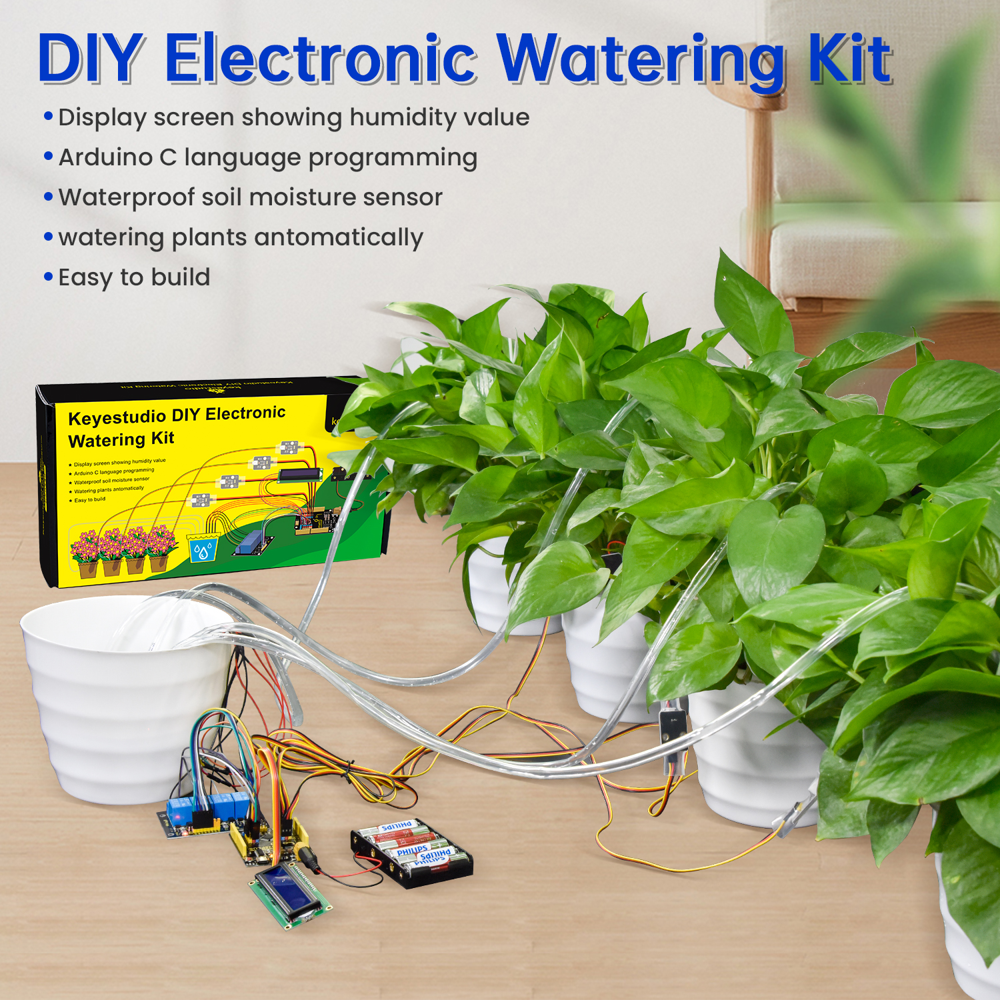
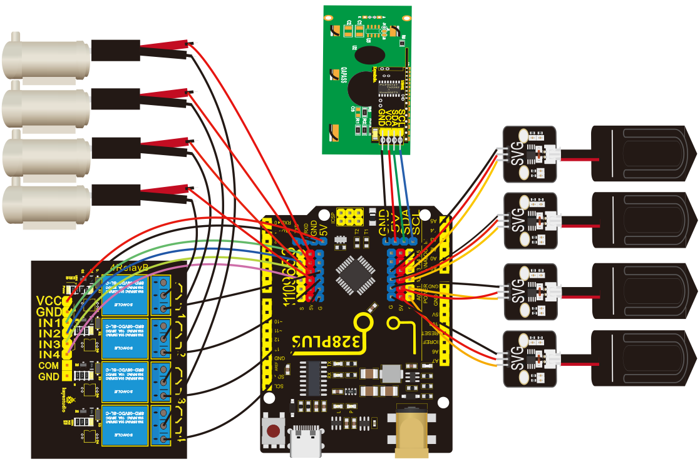
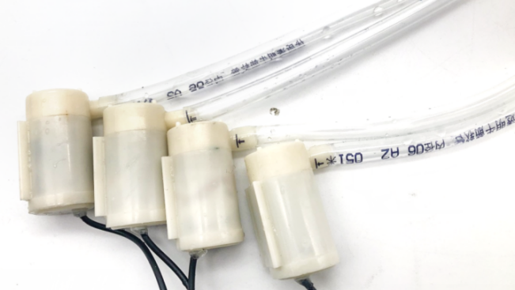
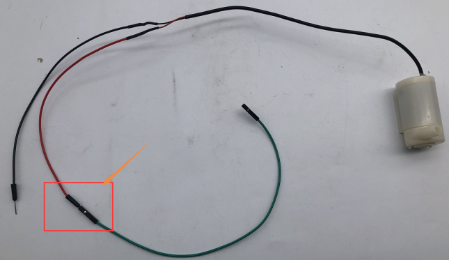
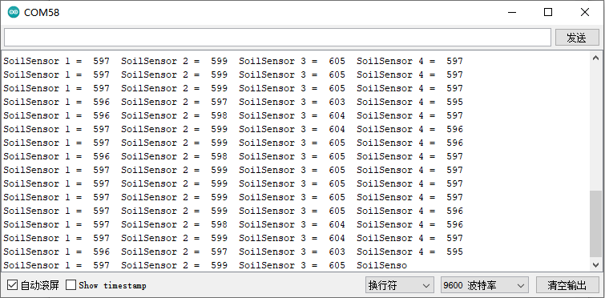

# KS0549 Keyestudio DIY Electronic Watering Kit

Description

As for some plants lovers, they are keen on spending time in caring for their
plants. Yet if they are busy in your work or entertainments, plants may wither
by virtue of lacking water. To avoid this, we launched an automatic watering
device with four humidity sensors and a water pump. It can water four plants
pots. An equipped display screen can show the humidity value of soil.

2\. Parameters

Working voltage: 5V

External power supply: DC 6-15V (recommended 9V)

DC output capability per I/O: 10 mA

3.3V port output: 150 mA max

Size: 68\*51\*11mm3

Weight: 22.5g

Wiring Diagram

Wire up water pipes with water pumps

F-F Dupont wires are connected to the positive pole of the water pump which is
the red wire. Then they will be connected with the 5V pins on the motherboard.

Project：

4.1 Control relay modules and water pumps

Parameters：

| Working voltage                                                                            | 2.5V\~6V |
|--------------------------------------------------------------------------------------------|----------|
| The inner diameter of a water pipe is 6mm                                                  |          |
| When voltage is 5V, the height of the water pipe from the pump cannot be higher than 105cm |          |

Description

The relay is an electric switch, and the water pump is a power device. We can
pump water by the relay switch.

Test Code：

| \#define IN1 3 \#define IN2 5 \#define IN3 6 \#define IN4 9  void setup() {  pinMode(IN1, OUTPUT);  pinMode(IN2, OUTPUT);  pinMode(IN3, OUTPUT);  pinMode(IN4, OUTPUT); }  void loop() {  digitalWrite(IN1, HIGH);  digitalWrite(IN2, HIGH);  digitalWrite(IN3, HIGH);  digitalWrite(IN4, HIGH);  delay(3000);  digitalWrite(IN4, LOW);  digitalWrite(IN3, LOW);  digitalWrite(IN2, LOW);  digitalWrite(IN1, LOW);  delay(1000); } |
|------------------------------------------------------------------------------------------------------------------------------------------------------------------------------------------------------------------------------------------------------------------------------------------------------------------------------------------------------------------------------------------------------------------------------------|

Test Result：

After uploading test code, you can see 4 relays turned on at the same time, the
water pumps starts to pump water, and stop after 3 seconds.

4.2 Soil Humidity Sensor

The soil humidity sensor is used for detecting soil humidity value, which can
determine if your plants are desperate for water

Read values detected by soil sensors

Description

Read values of the 4 soil humidity sensors and print them out in serial monitor
of Arduino IDE.

Test Code

| \#define soilPin1 A0 \#define soilPin2 A1 \#define soilPin3 A2 \#define soilPin4 A3  void setup() {  Serial.begin(9600);  pinMode(soilPin1, INPUT);  pinMode(soilPin2, INPUT);  pinMode(soilPin3, INPUT);  pinMode(soilPin4, INPUT); }  void loop() {  int val1 = analogRead(soilPin1);  int val2 = analogRead(soilPin2);  int val3 = analogRead(soilPin3);  int val4 = analogRead(soilPin4);  Serial.print("SoilSensor 1 = ");  Serial.print(val1);  Serial.print(" ");  Serial.print("SoilSensor 2 = ");  Serial.print(val2);  Serial.print(" ");  Serial.print("SoilSensor 3 = ");  Serial.print(val3);  Serial.print(" ");  Serial.print("SoilSensor 4 = ");  Serial.println(val4); } |
|-------------------------------------------------------------------------------------------------------------------------------------------------------------------------------------------------------------------------------------------------------------------------------------------------------------------------------------------------------------------------------------------------------------------------------------------------------------------------------------------------------------------------------------------------------------------------------------------------------------------------------------------------------------------------------------------|

Test Result

Upload the test code and open the serial monitor of Arduino IDE, you can see
that the values detected by the four soil humidity sensors are printed out.
Touch the detection area of the sensor when your hands are wet, values on the
monitor become smaller, which means that the more humid the soil, the smaller
the measured value.

4.3 Automatic watering device

Description：

We have learned how to control the water pump and read the value of the soil
humidity sensor, you can control the relay by observing the value detected by
the soil moisture sensor to realize a simple automatic flower watering device.

Test Code

| \#define soilPin1 A0 \#define soilPin2 A1 \#define soilPin3 A2 \#define soilPin4 A3 \#define IN1 3 \#define IN2 5 \#define IN3 6 \#define IN4 9  void setup() {  Serial.begin(9600);  pinMode(soilPin1, INPUT);  pinMode(soilPin2, INPUT);  pinMode(soilPin3, INPUT);  pinMode(soilPin4, INPUT);  pinMode(IN1, OUTPUT);  pinMode(IN2, OUTPUT);  pinMode(IN3, OUTPUT);  pinMode(IN4, OUTPUT); }  void loop() {  int val1 = analogRead(soilPin1);  int val2 = analogRead(soilPin2);  int val3 = analogRead(soilPin3);  int val4 = analogRead(soilPin4);  Serial.print("SoilSensor 1 = ");  Serial.print(val1);  Serial.print(" ");  Serial.print("SoilSensor 2 = ");  Serial.print(val2);  Serial.print(" ");  Serial.print("SoilSensor 3 = ");  Serial.print(val3);  Serial.print(" ");  Serial.print("SoilSensor 4 = ");  Serial.println(val4);  if(val1 \< 420){  digitalWrite(IN1, HIGH);  }else{  digitalWrite(IN1, LOW);  }  if(val2 \< 420){  digitalWrite(IN2, HIGH);  }else{  digitalWrite(IN2, LOW);  }  if(val3 \< 420){  digitalWrite(IN3, HIGH);  }else{  digitalWrite(IN3, LOW);  }  if(val4 \< 420){  digitalWrite(IN4, HIGH);  }else{  digitalWrite(IN4, LOW);  } } |
|-----------------------------------------------------------------------------------------------------------------------------------------------------------------------------------------------------------------------------------------------------------------------------------------------------------------------------------------------------------------------------------------------------------------------------------------------------------------------------------------------------------------------------------------------------------------------------------------------------------------------------------------------------------------------------------------------------------------------------------------------------------------------------------------------------------------------------------------------------------------------------------------------------------------------------------------------------------------------------------------------------------------------------------------------------------------------------------------------------------------------------------------------------------------------------------|

Test Result

Upload the test code, touch and hold the soil moisture sensor with your hand,
the corresponding relay is turned on, and the water pump pumps water. After
releasing the hand, the relay is turned off and the water pump stops pumping.

4.4 Control an LCD1602 display

You can view values detected by the soil sensor on the Arduino IDE serial
monitor.

We can add an LCD1602 display to show humidity values.

4.5 Display character strings and values

Description

The LCD1602 display is used for showing character strings

Test Code

| \#include \<Wire.h\>  \#include \<LiquidCrystal_I2C.h\>  LiquidCrystal_I2C lcd(0x27,16,2); // set the LCD address to 0x27 for a 16 chars and 2 line display  void setup() {  lcd.init(); // initialize the lcd   lcd.init();  // Print a message to the LCD.  lcd.backlight();  lcd.setCursor(2,0);  lcd.print("Hello, world!");  lcd.setCursor(2,1);  lcd.print("keyestudio"); }   void loop() { } |
|-----------------------------------------------------------------------------------------------------------------------------------------------------------------------------------------------------------------------------------------------------------------------------------------------------------------------------------------------------------------------------------------------------|

Test Result：

You can view the display show Hello World! on the first line and keyestudio on
the second line.

4.6 Display soil humidity values

Test Code

| \#include \<Wire.h\>  \#include \<LiquidCrystal_I2C.h\> LiquidCrystal_I2C lcd(0x27,16,2); // set the LCD address to 0x27 for a 16 chars and 2 line display \#define soilPin1 A0 \#define soilPin2 A1 \#define soilPin3 A2 \#define soilPin4 A3  void setup() {  lcd.init(); // initialize the lcd   lcd.init();  // Print a message to the LCD.  lcd.backlight(); }   void loop() {  int val1 = analogRead(soilPin1);  int val2 = analogRead(soilPin2);  int val3 = analogRead(soilPin3);  int val4 = analogRead(soilPin4);  lcd.setCursor(0,0);  lcd.print("S1:");  lcd.setCursor(3,0);  lcd.print(val1);  lcd.setCursor(7,0);  lcd.print(" ");  lcd.setCursor(9,0);  lcd.print("S2:");  lcd.setCursor(12,0);  lcd.print(val2);   lcd.setCursor(0,1);  lcd.print("S3:");  lcd.setCursor(3,1);  lcd.print(val3);  lcd.setCursor(7,1);  lcd.print(" ");  lcd.setCursor(9,1);  lcd.print("S4:");  lcd.setCursor(12,1);  lcd.print(val4);   delay(100); } |
|--------------------------------------------------------------------------------------------------------------------------------------------------------------------------------------------------------------------------------------------------------------------------------------------------------------------------------------------------------------------------------------------------------------------------------------------------------------------------------------------------------------------------------------------------------------------------------------------------------------------------------------------------------------------------------------------------------------------------------------------------------------------------------------------------------------------------------------------------------------------------------------------------------------------------------------------------------|

Test Result：

S1 represents the soil sensor 1. Therefore, we can view the LCD1602 display show
soil humidity values of four sensors，touch a sensor and observe the 1602
display;

4.7 Automatic watering device

Test Code

| \#include \<Wire.h\>  \#include \<LiquidCrystal_I2C.h\> LiquidCrystal_I2C lcd(0x27,16,2); // set the LCD address to 0x27 for a 16 chars and 2 line display \#define soilPin1 A0 \#define soilPin2 A1 \#define soilPin3 A2 \#define soilPin4 A3 \#define IN1 3 \#define IN2 5 \#define IN3 6 \#define IN4 9  int count, count_flag;  void setup() {  lcd.init(); // initialize the lcd   lcd.init();  // Print a message to the LCD.  lcd.backlight(); }   void loop() {  pinMode(IN1, OUTPUT);  pinMode(IN2, OUTPUT);  pinMode(IN3, OUTPUT);  pinMode(IN4, OUTPUT);  int val1 = analogRead(soilPin1);  int val2 = analogRead(soilPin2);  int val3 = analogRead(soilPin3);  int val4 = analogRead(soilPin4);  lcd.setCursor(0,0);  lcd.print("S1:");  lcd.setCursor(3,0);  lcd.print(val1);  lcd.setCursor(7,0);  lcd.print(" ");  lcd.setCursor(9,0);  lcd.print("S2:");  lcd.setCursor(12,0);  lcd.print(val2);   lcd.setCursor(0,1);  lcd.print("S3:");  lcd.setCursor(3,1);  lcd.print(val3);  lcd.setCursor(7,1);  lcd.print(" ");  lcd.setCursor(9,1);  lcd.print("S4:");  lcd.setCursor(12,1);  lcd.print(val4);  delay(200);  count = count + 1;  if(count \>= 50) //After 10 seconds, turn off the lCD1602 backlight  {  count = 50;  lcd.noBacklight();  }  if(val1 \> 590){  lcd.backlight();  count = 0;  digitalWrite(IN1, HIGH); // Water pump 1  delay(3000); //Pumping time is 3 seconds  digitalWrite(IN1, LOW); // Shut down the pump  delay(5000); //Water penetration time 5 seconds  }else{  digitalWrite(IN1, LOW);  }  if(val2 \> 590){  lcd.backlight();  count = 0;  digitalWrite(IN2, HIGH);  delay(3000);  digitalWrite(IN2, LOW);  delay(5000);  }else{  digitalWrite(IN2, LOW);  }  if(val3 \> 590){  lcd.backlight();  count = 0;  digitalWrite(IN3, HIGH);  delay(3000);  digitalWrite(IN3, LOW);  delay(5000);  }else{  digitalWrite(IN3, LOW);  }  if(val4 \> 590){  lcd.backlight();  count = 0;  digitalWrite(IN4, HIGH);  delay(3000);  digitalWrite(IN4, LOW);  delay(5000);  }else{  digitalWrite(IN4, LOW);  } } |
|--------------------------------------------------------------------------------------------------------------------------------------------------------------------------------------------------------------------------------------------------------------------------------------------------------------------------------------------------------------------------------------------------------------------------------------------------------------------------------------------------------------------------------------------------------------------------------------------------------------------------------------------------------------------------------------------------------------------------------------------------------------------------------------------------------------------------------------------------------------------------------------------------------------------------------------------------------------------------------------------------------------------------------------------------------------------------------------------------------------------------------------------------------------------------------------------------------------------------------------------------------------------------------------------------------------------------------------------------------------------------------------------------------------------------------------------------------------------------------------------------------------------------------------------------------------------------------------------------------------------------------------------------------------------------------------------------------------------------------------------------------------------------------------------------------------------------------------------------------------------------------------------------------------------------------------------------------------------------------------------------------------------------------------------------------|

Test Result：

Insert four soil moisture sensors into four plant pots, and put four water pump
pipes in the pots. You can see that the LCD1602 display show soil moisture
value. If soil is humid enough, the backlight of the LCD1602 display will be
turned off after 10 seconds, which can save power. If soil lacks water, the
backlight will light up, and water pumps will pump water to pots. After 3
seconds, the relay will be turned off, the water pump will stop pumping, and
wait for 5 seconds, then the soil humidity sensor will continue to detect.
