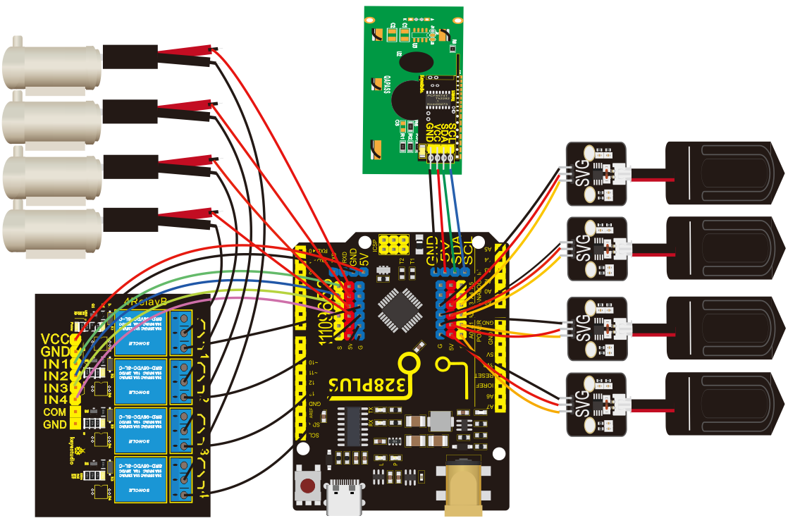
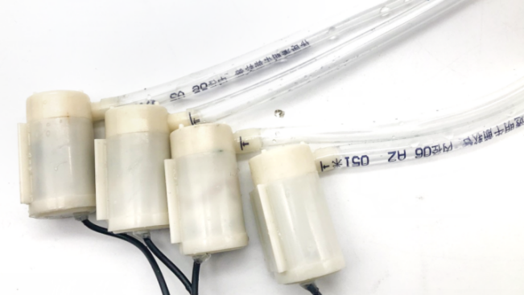
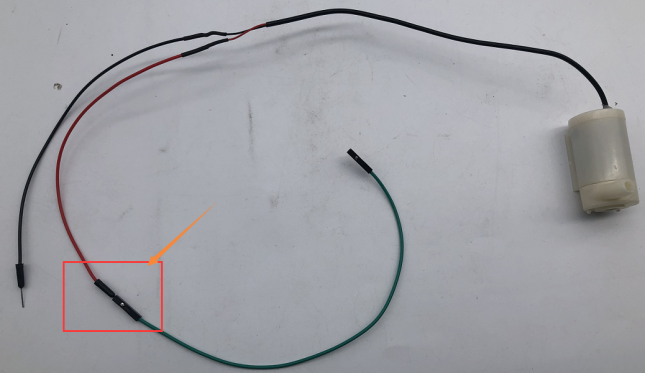

# **KS0549 Keyestudio DIY Electronic Watering Kit**

# 1. Resources Download

Download the codes, libraries and drivers: [Resources](./Resources.7z)

# 2. Description

As for some plants lovers, they are keen on spending time in caring for their plants. Yet if they are busy in your work or entertainments, plants may wither by virtue of lacking water. To avoid this, we launched an automatic watering
device with four humidity sensors and a water pump. It can water four plants pots. An equipped display screen can show the humidity value of soil.

# 3. Parameters

Working voltage: 5V

External power supply: DC 6-15V (recommended 9V)

DC output capability per I/O: 10 mA

3.3V port output: 150 mA max

Size: 68mm × 51mm × 11mm

Weight: 22.5g

# 4. Wiring Diagram

Wire up water pipes with water pumps

F-F Dupont wires are connected to the positive pole of the water pump which is the red wire. Then they will be connected with the 5V pins on the motherboard.

# 5. Get started with Arduino

**Click the link to start learning how to download software, install drivers, upload code, and install library files.**

**[https://getting-started-with-arduino.readthedocs.io](https://getting-started-with-arduino.readthedocs.io/en/latest/Arduino%20IDE%20Tutorial.html)**

