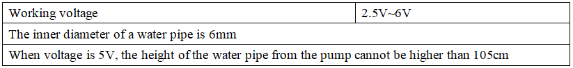

## 5.1 Control relay modules and water pumps

**Parameters：**



**Description**

The relay is an electric switch, and the water pump is a power device. We can pump water by the relay switch.

**Test Code：**

```C
#define IN1 3
#define IN2 5
#define IN3 6
#define IN4 9

void setup() {
  pinMode(IN1, OUTPUT);
  pinMode(IN2, OUTPUT);
  pinMode(IN3, OUTPUT);
  pinMode(IN4, OUTPUT);
}

void loop() {
  digitalWrite(IN1, HIGH);
  digitalWrite(IN2, HIGH);
  digitalWrite(IN3, HIGH);
  digitalWrite(IN4, HIGH);
  delay(3000);
  digitalWrite(IN4, LOW);
  digitalWrite(IN3, LOW);
  digitalWrite(IN2, LOW);
  digitalWrite(IN1, LOW);
  delay(1000);
}
```

**Test Result：**

After uploading test code, you can see 4 relays turned on at the same time, the water pumps starts to pump water, and stop after 3 seconds.