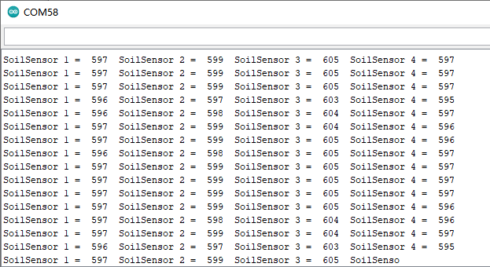

## 5.2 Soil Humidity Sensor

The soil humidity sensor is used for detecting soil humidity value, which can determine if your plants are desperate for water.

**Description**

Read values of the 4 soil humidity sensors and print them out in serial monitor of Arduino IDE.

**Test Code**

Read values detected by soil sensors.

```C
#define soilPin1 A0
#define soilPin2 A1
#define soilPin3 A2
#define soilPin4 A3

void setup() {
  Serial.begin(9600);
  pinMode(soilPin1, INPUT);
  pinMode(soilPin2, INPUT);
  pinMode(soilPin3, INPUT);
  pinMode(soilPin4, INPUT);
}

void loop() {
  int val1 = analogRead(soilPin1);
  int val2 = analogRead(soilPin2);
  int val3 = analogRead(soilPin3);
  int val4 = analogRead(soilPin4);
  Serial.print("SoilSensor 1 =  ");
  Serial.print(val1);
  Serial.print("  ");
  Serial.print("SoilSensor 2 =  ");
  Serial.print(val2);
  Serial.print("  ");
  Serial.print("SoilSensor 3 =  ");
  Serial.print(val3);
  Serial.print("  ");
  Serial.print("SoilSensor 4 =  ");
  Serial.println(val4);
}
```

**Test Result**

Upload the test code and open the serial monitor of Arduino IDE, you can see that the values detected by the four soil humidity sensors are printed out. Touch the detection area of the sensor when your hands are wet, values on the monitor become smaller, which means that the more humid the soil, the smaller the measured value.

